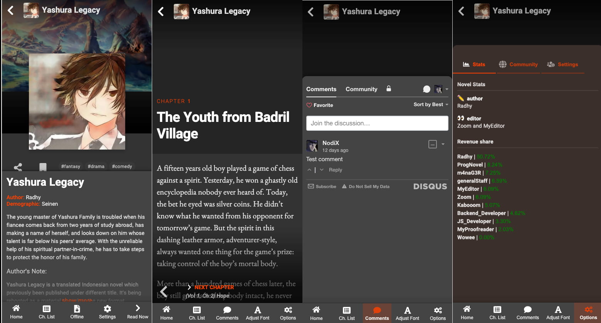

# 🚀 ProgNovel

[Demo](https://demo.prognovel.com) | [Promotional Video](https://youtu.be/4nBUq1638zk)

ProgNovel Promotional Video (YouTube):

ProgNovel is a JAMstack web app to make great webnovels. The main feature of ProgNovel, beside offline-first
web app with offline read features and great performance, is to be able to inject interactive plugins
for content creators to experiment with. Because ProgNovel built mainly in Jamstack architecture, it can be hosted with great loading page performance on many Jamstack platform free-tier offerings such as Netlify and Cloudflare Workers.

## Screenshot

<figure>

<figcaption>ProgNovel on Desktop</figcaption>
</figure>
<figure>

<figcaption>ProgNovel on Desktop</figcaption>
</figure>

## Self-host ProgNovel

Although ProgNovel strives to be as simple as possible, it is currently very difficult to create a smooth flow for deployment due to how young Jamstack ecosystem is (the architecture ProgNovel uses). In the future as the toolings more mature, we're hoping to simplify the deployment process - but for now we'll have to get our hands dirty and go through several steps in getting your ProgNovel ready.

ProgNovel works best when hosted on Jamstack platforms for performance and effiency purpose. Recommended platforms to host ProgNovel's frontend are Netlify, Vercel, and Cloudflare Page.

> ❗ Before hosting the frontend, make sure you don't skip hosting your first ProgNovel backend on Cloudflare Workers and publishing content with ProgNovel CLI so that the frontend has something to build with.

1. You need to get your backend hosted on Cloudflare Workers: [read how to host ProgNovel backend here.](https://github.com/prognoveljs/prognovel-workers)
2. Publish your first content to your backend. Yes, publish first before even you have an actual website. This is because part of ProgNovel webapp are static and need to pull some content first to build web pages. Follow on [how to get your first content published with ProgNovel CLI here](https://github.com/prognoveljs/prognovel-cli).
3. Have a Github account and fork this repo (yes, this repo you are reading).
4. You'll have have your own forked copy of prognovel frontend app in your Github account - use that to connect with Jamstack hosting platforms like [Netlify](https://www.netlify.com/), [Vercel](https://vercel.com/), or [Cloudflare Page](https://pages.cloudflare.com/).

> **NOTE:** For now, it is recommended to host on Netlify since there are still bugs when hosting on Vercel and Cloudflare Pages.

5. Fill the build configuration with these:

- Build command: `npm run build`
- Publish/output directory: `__sapper__/export/`
- Under secret environment section, create new variable with key `BACKEND_API` and value of URL of your backend API you create previously (usually is `https://api.{your-cloudflare-account}.workers.dev`).

6. Wait for your hosting platforms building your ProgNovel App, which might takes 2~10 minutes depending on the hosting platform you used. Usually you'll be notified in the dashboard with the link of your newly created site once the build is complete.
7. (Optional) If you need to upgrade your ProgNovel app, simply click fetch upstream in your forked repo. Your hosting platforms will usually detects change in your repo and will rebuild the app with the latest codebase.

## Other links

[ProgNovel on Web Monetization community space](https://community.webmonetization.org/prognovel) 
[ProgNovel on Twitter](https://twitter.com/ProgNovel) 
[ProgNovel on Reddit](https://www.redit.com/r/prognovel)

## Credits

ProgNovel is honored to join ranks of experimenters and innovators in the Web Monetization space as a spark Grant for the Web grantee during June~December 2021.

## License and Fair Use

ProgNovel is licensed with Apache 2.0. See [license details](LICENSE.md) for more information.
